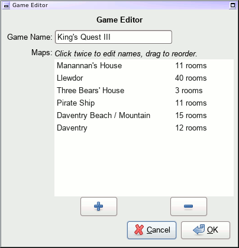
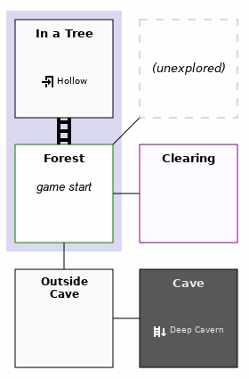
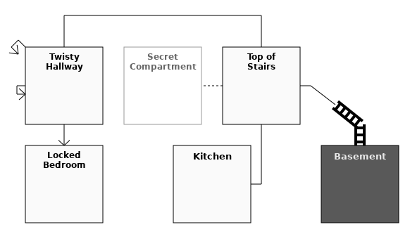
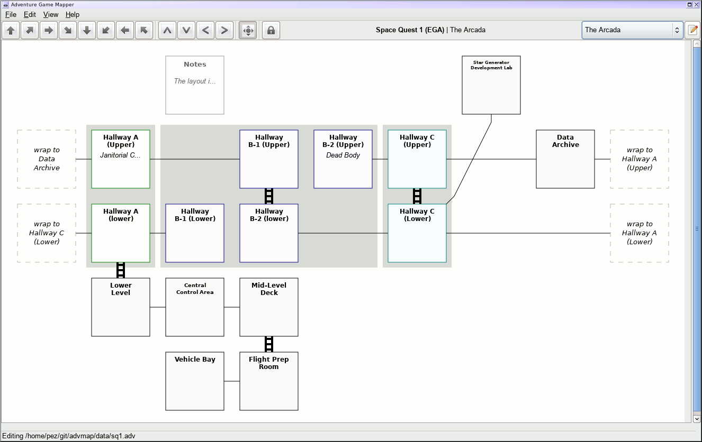
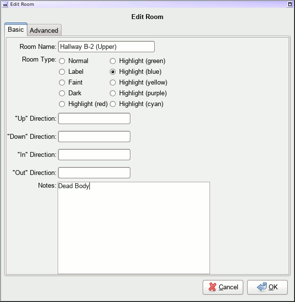

Adventure Game Mapper
---------------------

This is an experimental mapping program for adventure games, such as the old
Sierra adventures, and interactive fiction (such as from Infocom, etc).

It's got some good points and bad points; a lot of it's a little bizarre,
though it worked well enough for my purposes while I was going on a huge
adventure game binge a number of years ago.

The file format itself is currently all binary -- I struggled for awhile with
the knowledge that really I should be using some kind of gzipped XML format
rather than binary, but I have something of a grudge against XML and tend to
avoid it whenever possible.

Anyway, inside `data` there's a bunch of sample ones that I had created and
played around with.  Perhaps this'll be of use to someone.

Running
=======

This is written in Python 2, using PyGTK2/PyCairo, and is therefore a gtk+-2
application.  As far as I know, PyGTK2 doesn't work with Python 3 (you've
instead got to start using gobject for gtk+-3 bindings instead), so this
remains a Python 2 app.

I've developed this and run it exclusively on Linux, but it should work on
anything you can get PyGTK2/PyCairo to work on.  I believe that's not too
difficult on Windows, though it will probably give OSX users a run for their
money.

This doesn't have a `setup.py`, alas - just run it from this directory and
load up a file in the `data` directory, or start making your own.

Abilities
=========

This app should be able to serve for most mapping needs, though it's sometimes
a bit clumsy.  Mapping out the maze from Zork I, for instance, is an
"interesting" process and takes a bunch of finagling to look good.  In general
this does a great job, though.

The app supports containing multiple maps within the same game, accessible
via a dropdown and button in the upper right.  Due to a limitation of the way
we're handling the graphics, each individual map can have a maximum of 256
rooms, which is kind of lame, but so far that's not been a problem.

Rooms can be highlighted in a number of colors, including a "dark" setting
that I'm fond of using for dark rooms in the Zork series.  A number of text
labels can be attached to rooms, and will be rendered with appropriate
icons: up/down/in/out.  A "notes" field exists for more general gameplay
notes, and is useful for mapping things like the Zork I maze.

Connections between rooms are pretty flexible - you can specify regular,
"ladder", or dotted lines for the connection, and optionally have different
styles on each side of the connection.  The line drawn between rooms can take a
few different paths as well, and one-way connections can be specified as well.
You can have a connection go to multiple points on the same room, which is at
least useful in mapping Zork III.  The main limitation for connections is that
they can only support going between two rooms - no more.  For a situation like
the bank puzzle in Zork II, you're best off with a "label" type room in an
intermediate space.

Rooms can be "grouped" together, which mostly just means that there'll be
a highlighted background bounding the selected rooms.  I mostly end up using
it for graphical adventures where a single graphical screen is really two
logical rooms which aren't directly accessible without leaving the screen.
Sierra did this quite a bit, especially with the Space Quest series.  (See
below for a map of the opening area of Space Quest I, with grouping.)

Right now the only actual export format is PNG.

Usage
=====

Links between rooms can most easily be placed in the main GUI area, by clicking
on the borders of the rooms.  If two rooms are next to each other, clicking the
borders will automatically link them up - otherwise a new room will be created.
Middle-clicks and and right-clicks are also supported to do various things;
text at the bottom of the window will update to let you know what actions you can
take.

You can also nudge a room in the cardinal directions by using WASD.  If you enable
a toggle switch at the top of the screen, you can also nudge rooms by clicking on
the inside of the room itself (again, text at the bottom of the window will always
tell you what actions are possible with what keys).  Clicking on the main room
itself will allow you to edit the room, add notes, etc.  Currently the room-edit
dialog does *not* support editing the room connections; this may return eventually.

Controls while highlighting a room:

* `Left Mouse` - Edit room details (Room Name, type, up/down/in/out labels, notes, vert/horiz offsets, room grouping)
* `W`/`A`/`S`/`D` - Nudge room North/West/South/East
* `X` - Delete the room
* `H` - Toggle horizontal offset (useful in some circumstances to make maps look prettier)
* `V` - Toggle vertical offset (useful in some circumstances to make maps look prettier)
* `T` - Change room type
* `G` *(while room is ungrouped)* - Add room to a group with other room(s).  Mostly just a highlighted background around the rooms in question.
* `G` *(while room is in group)* - Change group highlight color
* `O` *(while room is in group)* - Remove room from group

Controls while highlighting the edge of a room *(if toggled on at the top of the screen)*:

* `Left Mouse` - Nudge room in the specified direction

Controls while highlighting an "empty" connection on the side of a room:

* `Left Mouse` - Create new connected room *(or connect to existing room if one is directly adjacent already)*
* `Right Mouse` - Connect to existing room *(use right mouse again on another room's empty slot to connect)*
* `Middle Mouse` - Create a loopback connection

Controls while highlighting an existing connection:

* `Right Mouse` - Move connection *(use right mouse again to specify target)*
* `C` - Remove connection
* `E` - Add an extra connection end on the same room.  Helpful in Zork III mapping, at least.  *(use E again to specify new location)*
* `T` - Change connection type *(regular, ladder, dotted)*
* `P` - Change path *(straight line or kinked/bent line)*
* `O` - Change orientation *(two-way, one-way in, one-way out)*
* `L` - Change stub length *(how far out the initial line is drawn before it gets connected to the other room)*
* `S` - Toggle symmetry within the link *(so one half of the connection can be ladder and the other dotted, for instance)*
* `R` - Sets the primary direction when a connection with multiple ends is being used (via the `E` key).  The "primary" direction is rendered more directly than any extra end.

Screenshots
===========

