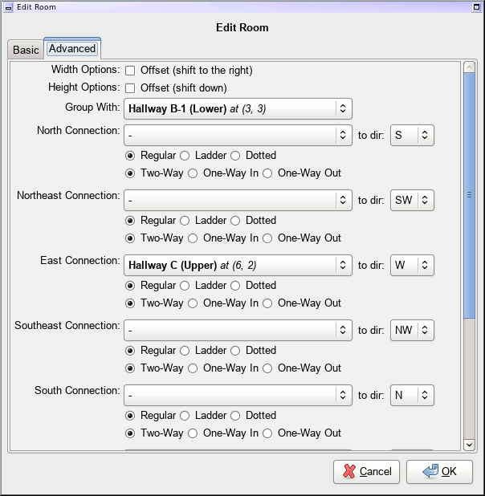

Adventure Game Mapper
---------------------

This is an experimental mapping program for adventure games, such as the old
Sierra adventures, and interactive fiction (such as from Infocom, etc).

It's got some good points and bad points; a lot of it's a little bizarre,
though it worked well enough for my purposes while I was going on a huge
adventure game binge a number of years ago.

The file format itself is currently all binary -- I struggled for awhile with
the knowledge that really I should be using some kind of gzipped XML format
rather than binary, but I have something of a grudge against XML and tend to
avoid it whenever possible.

Anyawy, inside `data` there's a bunch of sample ones that I had created and
played around with.  Perhaps this'll be of use to someone.

Running
=======

This is written in Python 2, using PyGTK2/PyCairo, and is therefore a gtk+-2
application.  As far as I know, PyGTK2 doesn't work with Python 3 (you've
instead got to start using gobject for gtk+-3 bindings instead), so this
remains a Python 2 app.

I've developed this and run it exclusively on Linux, but it should work on
anything you can get PyGTK2/PyCairo to work on.  I believe that's not too
difficult on Windows, though it will probably give OSX users a run for their
money.

This doesn't have a `setup.py`, alas - just run it from this directory and
load up a file in the `data` directory, or start making your own.

Usage
=====

Links between rooms can most easily be placed in the main GUI area, by clicking
on the borders of the rooms.  If two rooms are next to each other, clicking the
borders will automatically link them up - otherwise a new room will be created.
Middle-clicks and and right-clicks are also supported to do various things;
text at the bottom of the window will update to let you know what actions you can
take.

You can also nudge a room in any direction by clicking more on the inside of the
room itself.  Clicking on the main room itself will allow you to edit the room,
add notes, and manually tweak any connections coming into/out of the room.

Screenshots
===========

