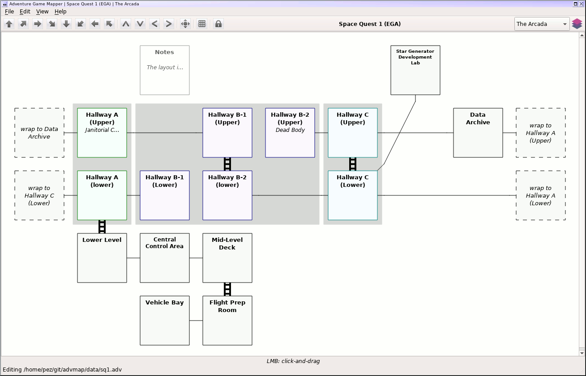
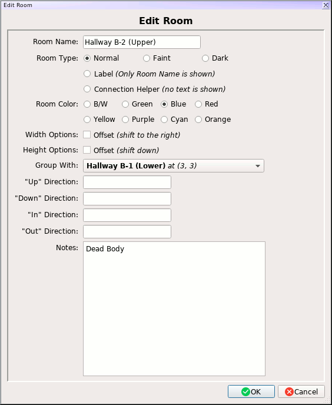

Adventure Game Mapper
=====================

This is an experimental mapping program for adventure games, such as the old
Sierra / LucasArts adventures, and interactive fiction (such as from Infocom,
etc).

It's got some good points and bad points; a lot of it's a little bizarre.
Regardless, I've been using it off and on since 2010, whenever I go on an
adventure game bender, and it's continued to perform well for me.  (Though
the odd game will end up prompting more feature enhancements to support
more mapping possibilities -- the Zork series in particular prompted more
features than just about the rest combined.)

The file format itself is currently a custom binary format.  This may end
up eventually changing to something like gzipped json, though I'm not sure
if that's something I care enough to change.

Inside the `data` directory, you can find the collected maps that I've produced
over the years, as well as a few testing maps.  For the most part these
shouldn't contain too many non-map-related spoilers, though there were a few
games which I'd used the map as a general- purpose note-taking device as well.

Running
-------

This application is written in Python 3 (only tested with Python 3.6), using
PyQt5 as its GUI toolkit.  Previous versions of the app used PyGTK2 and used
only supported Python 2.  The old Gtk+ version is available in the
`obsolete_pygtk` branch on GitHub, for convenience, but note that there won't
be any more updates to it, and it's already lagging behind.

I've developed this and run it exclusively on Linux, but it should work on
anything you can get PyQt to work on.  I believe that this should be possible
on both Windows and OSX, though I have no experience trying with either.

This doesn't have a `setup.py`, alas - just run it from this directory and
load up a file in the `data` directory, or start making your own.

Abilities
---------

This app should be able to serve for most mapping needs, though it's sometimes
a bit clumsy.  Mapping out the maze from Zork I, for instance, is an
"interesting" process and takes a bunch of finagling to look good.  In general
this does a great job, though.

The app supports containing multiple maps within the same game, accessible
via a dropdown and button in the upper right:

Rooms can be highlighted in a number of styles:

* Normal
* Faint
* Dark
* Labels *(dotted border, only the room name is shown)*
* Connection Helpers *(intended to help route connections - no text is shown)*

I'm fond of using the Dark setting for dark rooms in the Zork series, for instance.
Rooms can also be colored with any one of eight colors: black+white, green, blue,
red, yellow, purple/magenta, cyan, and orange.  A number of text labels can be
attached to rooms, and will be rendered with appropriate icons: up/down/in/out.
A "notes" field exists for more general gameplay notes, and is useful for mapping
things like the Zork I maze.  The screenshot below includes all room types, including
a Connection Helper connecting "In A Tree" to "Outside Cave."

Connections between rooms are pretty flexible - you can specify regular,
"ladder", or dotted lines for the connection, and optionally have different
styles on each side of the connection.  The line drawn between rooms can take a
few different paths (direct vs. "bent"), and one-way connections can be specified
as well.  You can have a connection go to multiple points on the same room, which
is at least useful in mapping Zork III.  The main limitation for connections is that
they can only support going between two rooms - no more.  For a situation like
the bank puzzle in Zork II, you're best off with a "label" type room in an
intermediate space.  The room type Connection Helper can be used to route connections
around more complex paths, though note that technically you're just connecting to
an intermediate room, so changing the connection type must be done on both ends if
you wanted it to remain symmetric, in that case.

Rooms can be "grouped" together, which mostly just means that there'll be
a highlighted background bounding the selected rooms.  I mostly end up using
it for graphical adventures where a single graphical screen is really two
logical rooms which aren't directly accessible without leaving the screen.
Sierra did this quite a bit, especially with the Space Quest series.  (See
below for a map of the opening area of Space Quest I, with grouping.)

Maps can be exported in a variety of image formats, defaulting to PNG.

Usage
-----

As you move the mouse around the map area, text at the bottom of the window will
update to let you know what actions you can take at all times, so that may be
the easiest reference as to what can be done.

You can create a new room either by left-clicking on a connection point of an
existing room (the rooms will be connected unless you specify otherwise), or
by using the `n` key while highlighting an empty spot on the map.  You can
right-click on a connection point and then right-click on another room's
connection point to arbitrarily connect rooms.  You can also right-click on an
existing connection and then right-click elsewhere to *move* connections
around.  Middle-clicking on a connection point will cause a loopback to be
created.

You can also nudge a room in the cardinal directions by using WASD.  If you enable
a toggle switch at the top of the screen, you can also nudge rooms by clicking on
the inside of the room itself, though I find that to be tricker than just using WASD.
Clicking on the main room itself will allow you to edit the room, add notes, etc.

You can select multiple rooms with shift-click, which will let you change parameters
to groups of rooms at a time - most of the room keys below will work (I've noted where
they don't).

When you've selected any number of rooms with shift-click, you can copy rooms to the
internal clipboard with `Ctrl-C`, and then paste them later with `Ctrl-V`.  If you're
hovering over an empty room spot when you use `Ctrl-V`, the app will attempt to paste
the group of rooms relative to that position.  If you're not hovering over an empty
room spot, it will paste them in the first available spot it sees on the map, starting
in the upper-left corner.  Note that the spot you hover over might not contain a room
to be pasted.  For instance, if you've just selected the following rooms:

... the green highlighted room is where the "origin" of the paste would be.  Hitting
`Ctrl-V` somewhere else would cause the three rooms to be pasted "around" the spot
you're hovering, as shown in the screenshot.  Any connections and groups which the
rooms share will be included in the paste activity.

Controls while highlighting an empty spot on the map:

* `Left-click and Drag` - Move the map around
* `N` - Create a new room

Controls while highlighting a room or rooms:

* `Left Mouse` - Edit room details *(Room Name, type, up/down/in/out labels, notes, vert/horiz offsets, room grouping)*
* `Shift-Click` *(left mouse)* - Select room *(shift-click on more rooms to multi-select)*
* `W`/`A`/`S`/`D` - Nudge room(s) North/West/South/East
* `X` - Delete the room *(unavailable while selecting more than one room)*
* `H` - Toggle horizontal offset(s) *(useful in some circumstances to make maps look prettier)*
* `V` - Toggle vertical offset(s) *(useful in some circumstances to make maps look prettier)*
* `T` - Change room type(s)
* `G` *(while room is ungrouped)* - Add room(s) to a group *(press G again on the other room, if you haven't selected multiple rooms already)*
* `G` *(while room is in group)* - Change group highlight color
* `O` *(while room is in group)* - Remove room(s) from group

Controls while highlighting the edge of a room *(if toggled on at the top of the screen)*:

* `Left Mouse` - Nudge room in the specified direction

Controls while highlighting an "empty" connection point on the side of a room:

* `Left Mouse` - Create new connected room, if there is an empty space for the room
* `Right Mouse` - Connect to existing room *(use right mouse again on another room's empty slot to connect)*
* `Middle Mouse` - Create a loopback

Controls while highlighting an existing connection:

* `Right Mouse` - Move connection *(use right mouse again to specify target)*
* `C` - Remove connection
* `E` - Add an extra connection end on the same room.  Helpful in Zork III mapping, at least.  *(use E again to specify new location)*
* `T` - Change connection type *(regular, ladder, dotted)*
* `P` - Change path *(straight line or kinked/bent line)*
* `O` - Change orientation *(two-way, one-way in, one-way out)*
* `L` - Change stub length *(how far out the initial line is drawn before it gets connected to the other room)*
* `S` - Toggle symmetry within the connection *(so one half of the connection can be ladder and the other dotted, for instance)*
* `R` - Sets the primary direction when a connection with multiple ends is being used (via the `E` key).  The "primary" direction is rendered more directly than any extra end.

More Screenshots
----------------

Savegame Format Reference
-------------------------

Just for my own purposes, here's a list of what's changed in each savegame
format revision.  The app can load any savegame version (so long as the app
is current, of course) but will always save in the most recent:

**v1**

* Initial Savefile format
  * Room attributes:
    * Name
    * Style/coloration
    * Up/Down/In/Out/Notes text labels
    * Horizontal/Vertical offsets
  * Supports grouping of rooms (only w/ grey color).
  * Connection styles: regular, dotted, ladder

**v2**

* Added one-way connections.

**v3**

* Added loopback connections.

**v4**

* Added path selection choice for connections (direct vs. "bent").

**v5**

* Added ability to set "stub length" on connections.

**v6**

* Added group coloration styles.

**v7**

* Major overhaul of connections:
  * Connections can have more than one end connected to each of the
    two rooms.
  * Nonsymmetric connections: can have stub length, style, and path
    selection defined on a per-end basis *(the "primary" connection
    between two rooms will share a path selection)*.

**v8**

* Split room types (normal, faint, dark, label) from coloration, so they
  can be set independently.  So dark/faint/label rooms can have a color
  set, just like normal rooms.
* Added "Connection Helper" room type which just serves as a passthrough
  for more complex connection paths.  No text is drawn for Connection Helpers.
* Added Orange as a color.

**v9**

* No format differences - version bump used to fix some internal data
  inconsistency.
